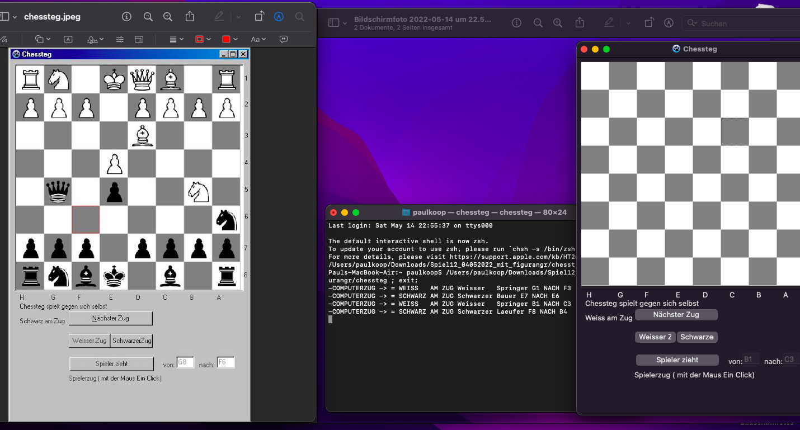
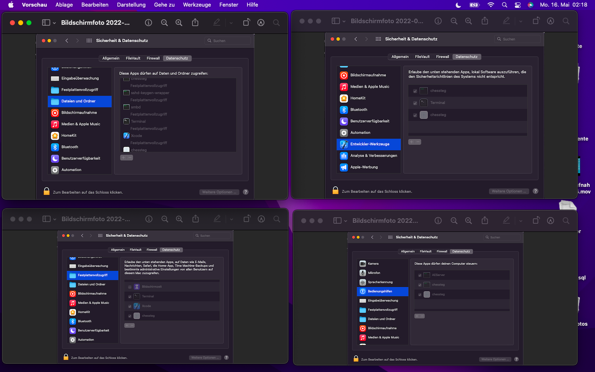
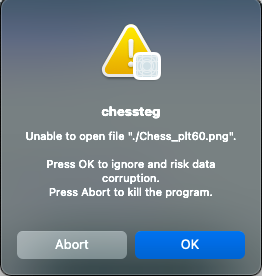

# chessteg
chess Lazarus Object Pascal

Ich benötige Hilfe: 
Ich habe Probleme mit dem Dateisystem von MacOS.
Mein Schachprogramm verwendet für die Darstellung der Figuren auf dem Brett Bilddateien (PNG).
Die Version für Windows (Object Pascal  Lazarus) kann auf die Dateien zugreifen.
Die Version für MacOS (Object Pascal Lazarus) nicht:
Ich bin für Hilfe dankbar

I need help:
I have problems with the MacOS file system.
My chess program uses image files (PNG) to display the pieces on the board.
The version for Windows (Object Pascal Lazarus) can access the files.
The version for MacOS (Object Pascal Lazarus) does not:
I am grateful for help

